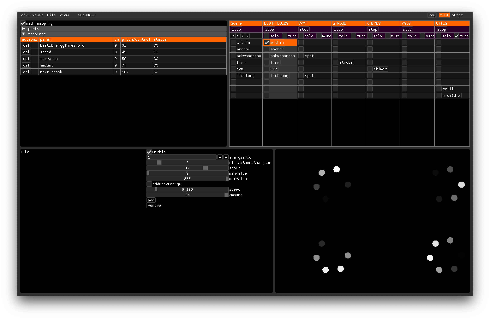

# ofxLiveSet

## Description
ofxLiveSet is an openframeworks addon, developed for the *klanglichtstrom* performance. 
It helps to set up session based live sets, it is very much inspired by ableton live's workflow.

This is a work in progress, it is sill buggy, incomplete and not yet clean. It is very likely that the codebase will change.

## Build status

## Features
### Supports different types of tracks and clips
* graphics (everything that can be drawn onto an ofFbo)
* dmx
* audio (not yet, working on it)
* can be easily extended

### Gui
It comes with an ImGui.

### Mappable parameters
Almost all parameters are midi, key and osc mappable. 

## Changelog
### 2.0.0
    * using smart pointers instead of raw pointers
### 1.0.0 - first more or less stable version

## TODOs
### core
* fix constructor, setup order
* load/save
* dynamically adding tracks and clips
* lot of performance improvements
### audio
* add proper example
* timing/quantisation/...
* audio effect support
* vst/au support
### graphics
* scripting support via ofxLua
* effects e.g. via ofxPostProcessing
### mappers
* refactor ofxMidiMapper

## License
This project is released under MIT license, please note that dependencies might be released differently.

Copyright (c) 2019 Thomas Geissl

Permission is hereby granted, free of charge, to any person obtaining a copy
of this software and associated documentation files (the "Software"), to deal
in the Software without restriction, including without limitation the rights
to use, copy, modify, merge, publish, distribute, sublicense, and/or sell
copies of the Software, and to permit persons to whom the Software is
furnished to do so, subject to the following conditions:

The above copyright notice and this permission notice shall be included in all
copies or substantial portions of the Software.

THE SOFTWARE IS PROVIDED "AS IS", WITHOUT WARRANTY OF ANY KIND, EXPRESS OR
IMPLIED, INCLUDING BUT NOT LIMITED TO THE WARRANTIES OF MERCHANTABILITY,
FITNESS FOR A PARTICULAR PURPOSE AND NONINFRINGEMENT. IN NO EVENT SHALL THE
AUTHORS OR COPYRIGHT HOLDERS BE LIABLE FOR ANY CLAIM, DAMAGES OR OTHER
LIABILITY, WHETHER IN AN ACTION OF CONTRACT, TORT OR OTHERWISE, ARISING FROM,
OUT OF OR IN CONNECTION WITH THE SOFTWARE OR THE USE OR OTHER DEALINGS IN THE
SOFTWARE.
